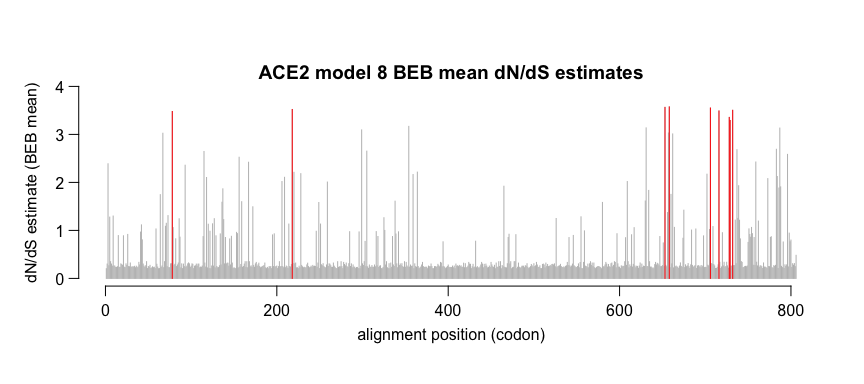
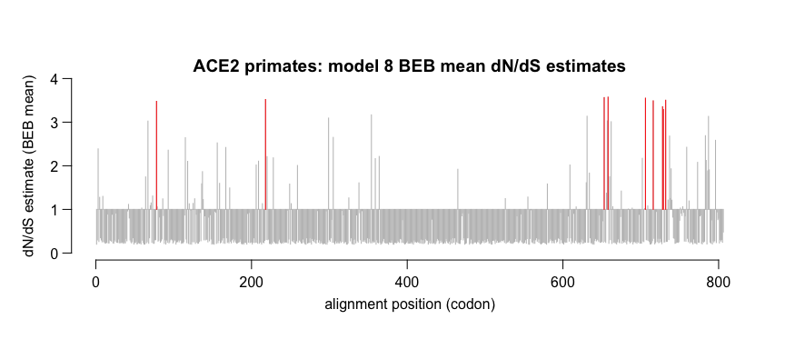
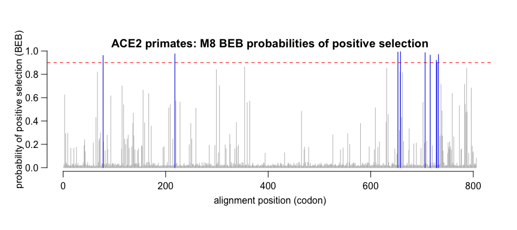
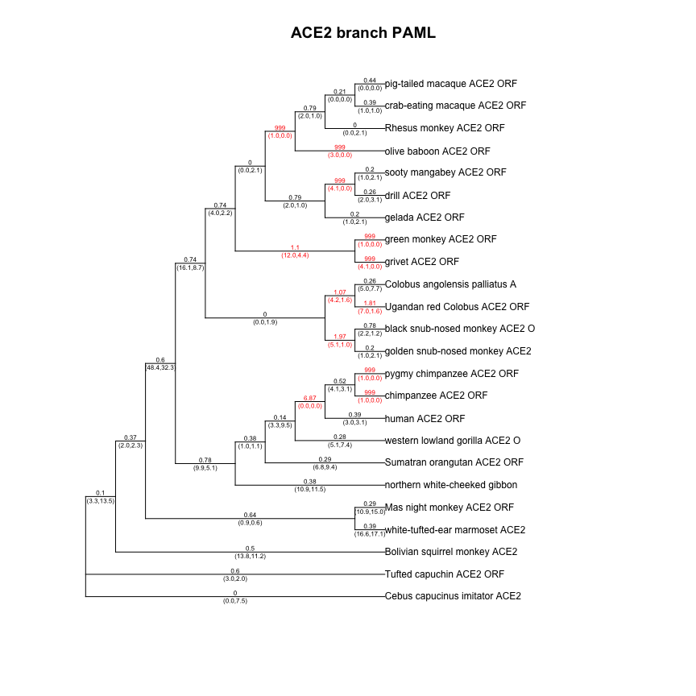
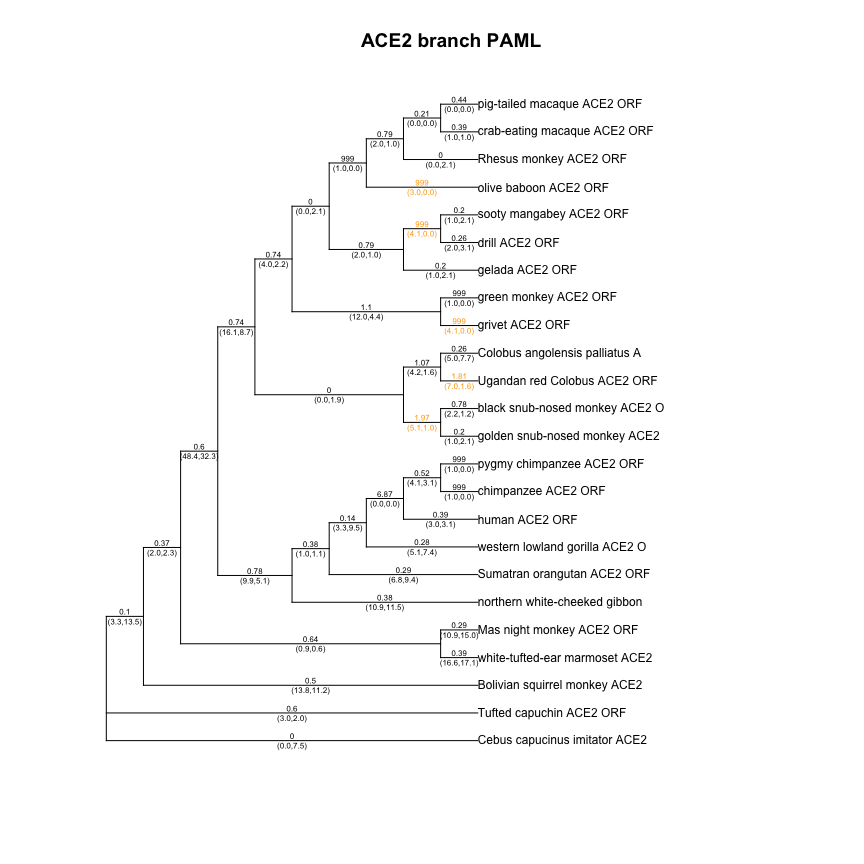
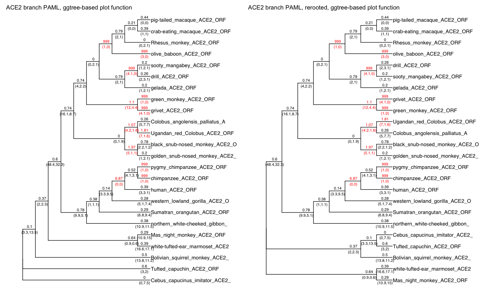

pamlApps demo code
================
Janet Young

2025-01-27

# sitewise PAML

Read a model 8 rst file:

``` r
ACE2_sitePAML_rstFile <- "data/paml_version_4.10.6/example_ACE2/M8_initOmega0.4_codonModel2/rst"

## get the BEB table as a data.frame
ACE2siteResults <- parseRSTfile(ACE2_sitePAML_rstFile) # %>% 
#  as_tibble()
```

look at that table for sites where BEB \>= 0.90

``` r
ACE2siteResults[which(ACE2siteResults[,"prob_class11_omega_4.69678"] >= 0.90),] %>% 
    as_tibble() %>% 
    dplyr::select(pos, human_ACE2_ORF, meanOmega, prob_class11_omega_4.69678)
```

    ## # A tibble: 9 × 4
    ##     pos human_ACE2_ORF meanOmega prob_class11_omega_4.69678
    ##   <int> <chr>              <dbl>                      <dbl>
    ## 1    78 T                   3.48                      0.961
    ## 2   218 S                   3.52                      0.975
    ## 3   653 Q                   3.56                      0.990
    ## 4   658 V                   3.57                      0.994
    ## 5   706 M                   3.55                      0.985
    ## 6   716 R                   3.49                      0.965
    ## 7   728 Q                   3.35                      0.921
    ## 8   729 P                   3.29                      0.901
    ## 9   732 G                   3.50                      0.969

plot BEB mean dN/dS estimate

``` r
plotOmegas(ACE2siteResults, 
           title="ACE2 model 8 BEB mean dN/dS estimates", 
           highlightHighBEB=TRUE, 
           highBEBthreshold=0.90, 
           highBEBcolor="red")
```

<!-- -->

plot BEB mean dN/dS estimate in a visually unusual way, where bars all
start at dN/dS=1. Our tetherin collaborators liked seeing the results
this way but it is not intuitive: makes it look like most sites have
dN/dS=1.

``` r
plotOmegas(ACE2siteResults, 
           title="ACE2 primates: model 8 BEB mean dN/dS estimates", 
           highlightHighBEB=TRUE, 
           highBEBthreshold=0.90, 
           highBEBcolor="red", 
           yAxisCenterAtNeutral=TRUE)
```

<!-- -->

plot BEB probabilities of being in the positively selected class

``` r
plotProbs(ACE2siteResults, 
          title="ACE2 primates: M8 BEB probabilities of positive selection",
          addThresholdLine=TRUE, 
          threshold=0.90, 
          thresholdLineColor="red",
          highlightHighBEB=TRUE, 
          highBEBthreshold=0.90, 
          highBEBcolor="blue")
```

<!-- -->

# Branch PAML

## using original functions (base R)

Read branch PAML’s main output file, which will be called `mlc` unless
you specified otherwise. The `parseMLCbranches()` function returns a
list with two objects, named `tree` (a phylo object) and `table` (a
data.frame containing all results reported in the tabular section of
PAML’s mlc output file).

``` r
ACE2_branchPAML_mlcFile <- "data/paml_version_4.10.6/example_ACE2/BRANCHpaml_initOmega0.4_codonModel2/mlc"

ACE2_branchPAML_results <- parseMLCbranches(ACE2_branchPAML_mlcFile)
```

    ## reading file data/paml_version_4.10.6/example_ACE2/BRANCHpaml_initOmega0.4_codonModel2/mlc

Use the output of `parseMLCbranches()` to plot the tree, showing N, S,
and dN/dS along each branch.

The default is to color the label for any branch where dN/dS \> 1.

``` r
plotTree(phymlTree=ACE2_branchPAML_results[["tree"]], 
         mlcTable=ACE2_branchPAML_results[["table"]], 
         labelType="omega_NS",
         myTitle="ACE2 branch PAML")
```

<!-- -->

I can change the dN/dS threshold, as well as requiring a minimum N\*dN
(number of non-synonymous changes), and I can use a different color:

``` r
plotTree(phymlTree=ACE2_branchPAML_results[["tree"]], 
         mlcTable=ACE2_branchPAML_results[["table"]], 
         labelType="omega_NS",
         myTitle="ACE2 branch PAML", 
         colorHighOmega=TRUE, 
         colorHighOmegaThreshold=1.5,
         colorHighOmegaThresholdNxN=3,
         highOmegaColor="orange")
```

<!-- -->

## using newer functions (uses ggtree), allows rerooting

``` r
ACE2_branchPAML_results_treeio_v2 <- parseMLCbranches_new(ACE2_branchPAML_mlcFile)

ACE2_branchPAML_results_treeio_v2_reroot <- root(
    ACE2_branchPAML_results_treeio_v2,
    node=getMRCA(ACE2_branchPAML_results_treeio_v2@phylo,
                 c("human_ACE2_ORF",
                   "white-tufted-ear_marmoset_ACE2")))

p1 <- plotTree_new(ACE2_branchPAML_results_treeio_v2, 
                   myTitle="ACE2 branch PAML, ggtree-based plot function")
p2 <- plotTree_new(ACE2_branchPAML_results_treeio_v2_reroot, 
                   myTitle="ACE2 branch PAML, rerooted, ggtree-based plot function")

p1 + p2
```

<!-- -->

# Finished

show R version used, and package versions

``` r
sessionInfo()
```

    ## R version 4.4.2 (2024-10-31)
    ## Platform: aarch64-apple-darwin20
    ## Running under: macOS Sequoia 15.2
    ## 
    ## Matrix products: default
    ## BLAS:   /Library/Frameworks/R.framework/Versions/4.4-arm64/Resources/lib/libRblas.0.dylib 
    ## LAPACK: /Library/Frameworks/R.framework/Versions/4.4-arm64/Resources/lib/libRlapack.dylib;  LAPACK version 3.12.0
    ## 
    ## locale:
    ## [1] en_US.UTF-8/en_US.UTF-8/en_US.UTF-8/C/en_US.UTF-8/en_US.UTF-8
    ## 
    ## time zone: America/Los_Angeles
    ## tzcode source: internal
    ## 
    ## attached base packages:
    ## [1] stats     graphics  grDevices utils     datasets  methods   base     
    ## 
    ## other attached packages:
    ##  [1] ggtree_3.14.0    treeio_1.30.0    ape_5.8-1        kableExtra_1.4.0
    ##  [5] patchwork_1.3.0  janitor_2.2.1    lubridate_1.9.4  forcats_1.0.0   
    ##  [9] stringr_1.5.1    dplyr_1.1.4      purrr_1.0.2      readr_2.1.5     
    ## [13] tidyr_1.3.1      tibble_3.2.1     ggplot2_3.5.1    tidyverse_2.0.0 
    ## [17] here_1.0.1      
    ## 
    ## loaded via a namespace (and not attached):
    ##  [1] gtable_0.3.6       xfun_0.50          lattice_0.22-6     tzdb_0.4.0        
    ##  [5] vctrs_0.6.5        tools_4.4.2        generics_0.1.3     yulab.utils_0.1.9 
    ##  [9] parallel_4.4.2     pkgconfig_2.0.3    ggplotify_0.1.2    lifecycle_1.0.4   
    ## [13] compiler_4.4.2     farver_2.1.2       munsell_0.5.1      snakecase_0.11.1  
    ## [17] ggfun_0.1.8        htmltools_0.5.8.1  yaml_2.3.10        lazyeval_0.2.2    
    ## [21] pillar_1.10.1      nlme_3.1-166       tidyselect_1.2.1   aplot_0.2.4       
    ## [25] digest_0.6.37      stringi_1.8.4      labeling_0.4.3     rprojroot_2.0.4   
    ## [29] fastmap_1.2.0      grid_4.4.2         colorspace_2.1-1   cli_3.6.3         
    ## [33] magrittr_2.0.3     utf8_1.2.4         withr_3.0.2        scales_1.3.0      
    ## [37] timechange_0.3.0   rmarkdown_2.29     hms_1.1.3          evaluate_1.0.3    
    ## [41] knitr_1.49         viridisLite_0.4.2  gridGraphics_0.5-1 rlang_1.1.4       
    ## [45] Rcpp_1.0.14        glue_1.8.0         tidytree_0.4.6     xml2_1.3.6        
    ## [49] svglite_2.1.3      rstudioapi_0.17.1  jsonlite_1.8.9     R6_2.5.1          
    ## [53] systemfonts_1.2.0  fs_1.6.5
